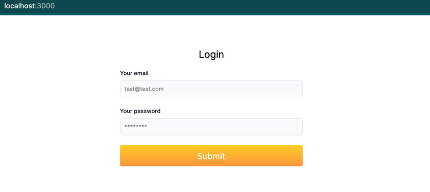

# Getting Started with Create React App

This project was bootstrapped with [Create React App](https://github.com/facebook/create-react-app).
## Development Environment
Node.js v16.15.1

Npm 9.6.1

React ^18.2.0

Yarn ^1.22.19

Tailwind CSS (^3.2.7)

TypeScript (^4.9.5)

## Routing

/login: Login page. (You can enter any email and password to get through the login page)



/my-record: My Record page (Required login -> Redirect to Login page)


/column: Column page (Not required login)


/ : Home page (Required login -> Redirect to Login page)


## Getting Started

First, install Yarn:

```bash
npm install --global yarn
```

Then, install all dependencies:

```bash
yarn install
```

In the project directory, you can run:

```bash
yarn start
```

Runs the app in the development mode.\
Open [http://localhost:3000](http://localhost:3000) to view it in the browser.

The page will reload if you make edits.\
You will also see any lint errors in the console.

```bash
yarn build
```

Builds the app for production to the `build` folder.\
It correctly bundles React in production mode and optimizes the build for the best performance.

The build is minified and the filenames include the hashes.\
Your app is ready to be deployed!

See the section about [deployment](https://facebook.github.io/create-react-app/docs/deployment) for more information.

```bash
yarn eject
```

**Note: this is a one-way operation. Once you `eject`, you can’t go back!**

If you aren’t satisfied with the build tool and configuration choices, you can `eject` at any time. This command will
remove the single build dependency from your project.

Instead, it will copy all the configuration files and the transitive dependencies (webpack, Babel, ESLint, etc) right
into your project so you have full control over them. All of the commands except `eject` will still work, but they will
point to the copied scripts so you can tweak them. At this point you’re on your own.

You don’t have to ever use `eject`. The curated feature set is suitable for small and middle deployments, and you
shouldn’t feel obligated to use this feature. However we understand that this tool wouldn’t be useful if you couldn’t
customize it when you are ready for it.

## Learn More

You can learn more in
the [Create React App documentation](https://facebook.github.io/create-react-app/docs/getting-started).

To learn React, check out the [React documentation](https://reactjs.org/).
